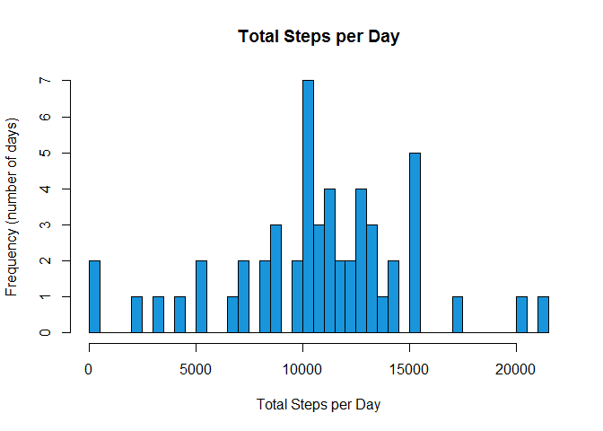
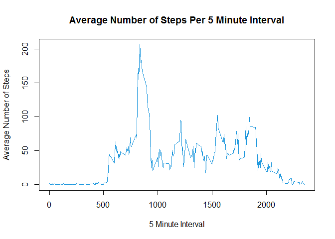
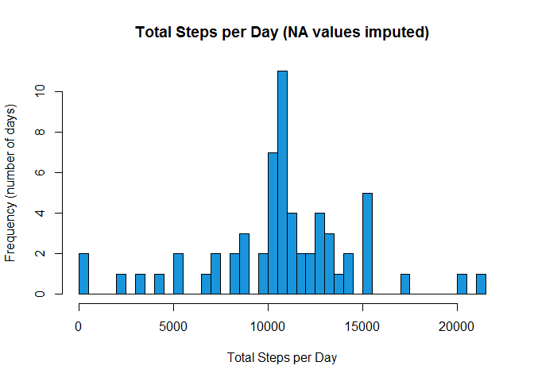
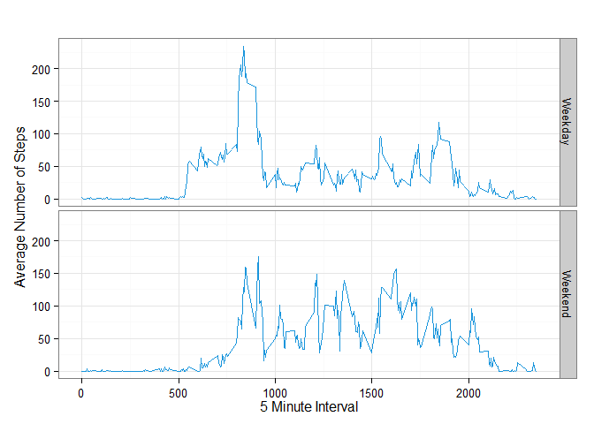

# Reproducible Research: Peer Assessment 1
October 2014  
  
  
   

```r
#Global variables and library references

library(plyr)
library(Hmisc)
library(ggplot2)
downloadFile <- "activity.zip"
fileName <- "activity.csv"
rowCount <- 17568 #total rows in the dataset
plotAxisColor = "#033c73"
plotSymbolColor = "#1995dc"

#Colors and formatting used for .html view

#http://htmlpreview.github.io/?https://github.com/alicemacdonald/RepData_PeerAssessment1/blob/master/PA1_template.html
```
  
To view an html version of this document, click [here](http://htmlpreview.github.io/?https://github.com/alicemacdonald/RepData_PeerAssessment1/blob/master/PA1_template.html).
  
#### 1. Loading and preprocessing the data

```r
if(!file.exists(paste0("./",fileName)))
{
  unzip(paste0("./",downloadFile))
  
  if(!file.exists(paste0("./",fileName)))
  {
    stop("Error: data not downloaded and unzipped.")
  }
}

prelimData <- read.csv(fileName, header=TRUE, sep=",")

##Import check: data should have 17,568 rows
if(nrow(prelimData) != rowCount)
{
    stop("Error: full dataset not imported.")
}
```
  
  
#### 2. What is mean total number of steps taken per day?

```r
dailySummaryQ2 <- ddply(prelimData,~date,summarise,TotalSteps=sum(steps))

# calculate mean and median values
stepMean <- prettyNum(ceiling(mean(dailySummaryQ2$TotalSteps,na.rm=TRUE)),big.mark=",")
stepMedian <- prettyNum(median(dailySummaryQ2$TotalSteps,na.rm=TRUE),big.mark=",")

hist(dailySummaryQ2[,2],
                breaks=50,
                main="Total Steps per Day",
                xlab="Total Steps per Day",
                ylab="Frequency (number of days)",
                col=plotSymbolColor)
```

 
  
The **average** number of steps taken per day is **10,767**  and the **median** number of steps taken per day is **10,765** (removing all NA values). 

  
  
#### 3. What is the average daily activity pattern?

```r
intervalSummaryQ3 <- ddply(prelimData,~interval,summarise,AverageSteps=mean(steps,na.rm=TRUE))
maxInterval <- intervalSummaryQ3[
                    max(intervalSummaryQ3$AverageSteps) == 
                        intervalSummaryQ3$AverageSteps,
            ]$interval

plot(intervalSummaryQ3$interval,
     intervalSummaryQ3$AverageSteps,
     xlab="5 Minute Interval",
     ylab="Average Number of Steps",
     main="Average Number of Steps Per 5 Minute Interval",
     type="l",
     col=plotSymbolColor)
```

 
  
 
Interval **835** is the 5-minute interval that contains the maximum number of steps (averaged across all days).  
  
  
  
#### 4. Imputing missing values

```r
# Imput missing values
# For all NA values, I will use the average steps (across all days) for that 5 minute period

missingValues <- sum(is.na(prelimData$steps))
imputedData <- ddply(prelimData, "interval", mutate, imputedSteps = impute(steps, mean))
dailySummaryQ4 <- ddply(imputedData,~date,summarise,TotalSteps=sum(imputedSteps))

# calculate mean and median values
stepMeanQ4 <- prettyNum(ceiling(mean(dailySummaryQ4$TotalSteps,na.rm=TRUE)),big.mark=",")
stepMedianQ4 <- prettyNum(ceiling(median(dailySummaryQ4$TotalSteps,na.rm=TRUE)),big.mark=",")

hist(dailySummaryQ4[,2],
     breaks=50,
     main="Total Steps per Day (NA values imputed)",
     xlab="Total Steps per Day",
     ylab="Frequency (number of days)",
     col=plotSymbolColor)
```

 
  
The total number of missing values in this dataset is **2304**.  After imputation, the **average** number of steps taken per day is **10,767** and the **median** number of steps taken per day is **10,767** (compared to 10,767 and 10,765 before imputation).  
  
   
#### 5. Are there differences in activity patterns between weekdays and weekends?

```r
imputedData$weekday <- weekdays(as.Date(imputedData$date))
imputedData[!imputedData$weekday %in% c("Saturday","Sunday"),]$weekday <- "Weekday"
imputedData[imputedData$weekday %in% c("Saturday","Sunday"),]$weekday <- "Weekend"

imputedDataDayTypeSummaryQ5 <- ddply(imputedData,
                           ~interval*weekday,
                           summarise,
                           AverageSteps=mean(steps,na.rm=TRUE))

g <- ggplot(imputedDataDayTypeSummaryQ5, aes(x=interval, y=AverageSteps))
g <- g + 
     facet_grid(weekday ~ .) +
     geom_line(colour=plotSymbolColor) +
     labs(x="5 Minute Interval") + 
     labs(y=expression("Average Number of Steps")) + 
     labs(title="") +
     theme_bw()

g
```

 

